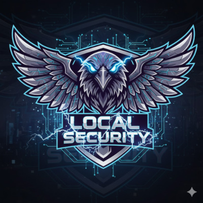

# TryHackMe Pathway Notes

## Common Knowledge
### Pre Security (COMPLETED)
- [Introduction to Cyber Security](Content/PreSecurity/Introduction-to-Cyber-Security.md)
- Network Fundamentals
    - [What is Networking?](Content/PreSecurity/Network-Fundamentals/001-What-is-Networking.md)
    - [Intro to LAN](Content/PreSecurity/Network-Fundamentals/002-Intro-to-LAN.md)
    - [OSI Model](Content/PreSecurity/Network-Fundamentals/003-OSI-Model.md)
    - [Packets & Frames](Content/PreSecurity/Network-Fundamentals/004-Packets-and-Frames.md)
    - [Extending your Network](Content/PreSecurity/Network-Fundamentals/005-Extending-your-Network.md)
- How The Web Works
    - [DNS in Detail](Content/PreSecurity/How-the-Web-Works/001-DNS-in-Detail.md)
    - [HTTP in Detail](Content/PreSecurity/How-the-Web-Works/002-HTTP-in-Detail.md)
    - [How Websites Work?](Content/PreSecurity/How-the-Web-Works/003-How-Websites-Work.md)
    - [Put it all together](Content/PreSecurity/How-the-Web-Works/004-Putting-it-all-together.md)
- [Linux Fundamentals](Content/PreSecurity/Linux-Fundamentals.md)
- Windows Fundamentals
    - [Part1: FileSystem & Accounts](Content/PreSecurity/Windows-Fundamentals/001-Part-1.md)
    - [Part2: System Tooling](Content/PreSecurity/Windows-Fundamentals/002-Part-2.md)
    - [Part3: Security](Content/PreSecurity/Windows-Fundamentals/003-Part-3.md)

### Cyber Security 101 (COMPLETED)
- [Start Your Cyber Security Journey]
- [Windows and AD Fundamentals]
- [Command Line]
- [Networking]
- [Cryptography]
- [Exploitation Basics]
- [Web Hacking]
- [Offensive Security Tooling]
- [Defensive Security]
- [Security Solutions]
- [Defensive Security Tooling]
- [Build Your Cyber Security Career]
- [OWASP Top 10 (2025)]

## Security Analyst
### SOC Level 1 (COMPLETED)
- [Blue Team Introduction]
- [SOC Team Internals]
- [Core SOC Solutions]
- [Cyber Defence Frameworks]
- [Phishing Analysis]
- [Network Traffic Analysis]
- [Network Security Monitoring]
- [Web Security Monitoring]
- [Windows Security Monitoring]
- [Linux Security Monitoring]
- [Malware Concepts for SOC]
- [Threat Analysis Tools]
- [SIEM Triage for SOC]

### SOC Level 2 (WORK IN PROGRESS)
- [Log Analysis]
- [Advanced Splunk]
- [Advanced ELK]
- [Detection Engineering]
- [Threat Hunting]
- [Threat Emulation]
- [Incident Response]
- [Malware Analysis]

### Advanced Endpoint Investigations (TO BE COMPLETED)
- [File System Analysis]
- [Linux Endpoint Investigation]
- [Windows Endpoint Investigation]
- [macOS Forensics]
- [Mobile Analysis]
- [Memory Analysis]
- [Disk Image Analysis]

## Security Engineer (TO BE COMPLETED)
- [Introduction to Security Engineering]
- [Threats and Risks]
- [Network and System Security]
- [Software Security]
- [Managing Incidents]
- [OWASP Top 10 (2025)]

